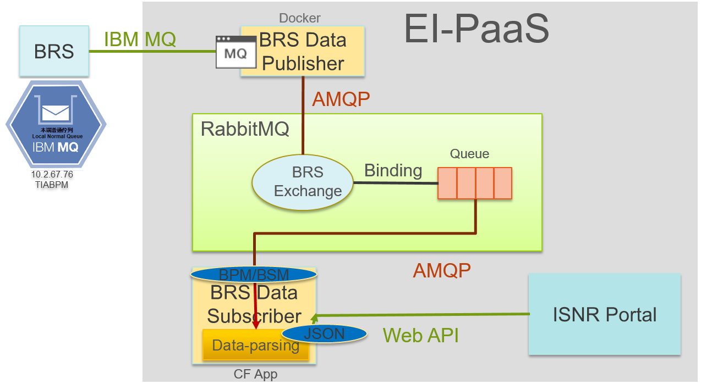

.. BRS-ib-publisher documentation master file, created by
   sphinx-quickstart on Tue Jun  4 14:55:56 2019.
   You can adapt this file completely to your liking, but it should at least
   contain the root `toctree` directive.

BRS-ib-publisher
##################

|

**功能：** 
 從IBM MQ Server取得BPM資料，將取得的原始內文，直接publish傳送到Rabbit MQ 的BPM序列中。

|
|

**IBMMQ 用戶端角色設定與軟體安裝 ：**
 以\ **應用程式（MQI 用戶端）**\的方式, 使用\ **雙向**\通訊鏈結的\ **MQI 通道 (MQI channel)**\，與伺服器機器上的佇列管理程式進行連接通訊。

        ..  image:: img/2.png
            :height: 162
            :width: 345

 應用程式（MQI 用戶端）, 必需先安裝\ **IBM-MQC**\，再使用pymqi套件與IBM Server連接傳訊。

 IBM-MQC 下載版本及安裝流程 (\ **Windows**\):
    (1) 安裝9.1.2.0-IBM-MQC-Win64\Windows\Setup.exe
    (2) 安裝vs_buildtools__299754906.1551855808.exe
    (3) 在命令列(CMD)中, 執行"pip install pymqi" 或 “pip install -r requirements.txt” (pymqi已列表於requirements.txt中)。

        ..  image:: img/10.png
            :height: 55
            :width: 132

|

 IBM-MQC 下載版本及安裝流程(\ **Linux**\):
    (1) sudo wget https://ak-delivery04-mul.dhe.ibm.com/sdfdl/v2/sar/CM/WS/086t9/0/Xa.2/Xb.jusyLTSp44S0eZU4L_Z8CxT9s111g6PLY3eV4pG5FjCmcyQcWmWZ1ZOteYw/Xc.CM/WS/086t9/0/9.1.0.2-IBM-MQC-UbuntuLinuxX64.tar.gz/Xd./Xf.LPR.D1VK/Xg.10174485/Xi.habanero/XY.habanero/XZ.aTYAtx6Ht3WYPrMxQwoSSSgiXys/9.1.0.2-IBM-MQC-UbuntuLinuxX64.tar.gz
    (2) mkdir IBMMQC
    (3) sudo tar -xvf 9.1.0.2-IBM-MQC-UbuntuLinuxX64.tar.gz -C ./IBMMQC
    (4) cd ./IBMMQC
    (5) sudo ./mqlicense.sh –accept
    (6) sudo dpkg -i ibmmq-runtime_9.1.0.2_amd64.deb
    (7) sudo dpkg -i ibmmq-client_9.1.0.2_amd64.deb 
    (8) sudo dpkg -i ibmmq-sdk_9.1.0.2_amd64.deb 
    (9) sudo apt install python3-pip
    (10) "pip3 install pymqi" 或 "pip install -r requirements.txt" (pymqi已列表於requirements.txt中)。
    (11) export LD_LIBRARY_PATH=$LD_LIBRARY_PATH:/opt/mqm/lib64/    

|

 IBM-MQC 下載版本及安裝流程(\ **Docker Image**\):
    參考"執行環境佈署"章節，將程式打包成 Docker Image 形式佈署的指令，即可自動安裝IBM-MQC的軟體及pymqi套件。
     Dockerfile中有關IBM-MQC軟體的列表:

        ..  image:: img/9.png
            :height: 95
            :width: 447
    
     Dockerfile檔:"RUN pip3 install -r requirements.txt"。

|
|

**RabbitMQ套件安裝 ：**
 應用程式需事先安裝\ **pika**\套件，以\ **AMQP**\的方法, 運用\ **綁定**\佇列與RabbitMQ伺服器機器進行連接通訊。
 
 RabbitMQ pika套件安裝:
  在命令列(CMD)中, 執行:
  "pip install pika" 或 "pip install -r requirements.txt" (pika已列表於requirements.txt中)。

        ..  image:: img/10.png
            :height: 55
            :width: 132

|
|

**執行環境佈署：**
 將程式打包成Docker Image 形式佈署。
    (1) docker build -t brspublisher .
    
        ..  image:: img/3.png
            :height: 70
            :width: 910

    (2) docker images
    
        ..  image:: img/4.png
            :height: 116
            :width: 1202

    (3) docker run -d --name brs-publisher brspublisher
    
        ..  image:: img/5.png
            :height: 110
            :width: 914

|
|

**啟動應用程式：**
 \ **Windows**\:
  在命令列(CMD)中, 執行"fetchVS.cmd"

 \ **Linux**\:
  "sh fetch.sh"
  
 \ **Docker Image**\:
   首次建立並執行: "docker run -d –name brs-publisher brspublisher"

   啟動已建立的Docker: "docker start brs-publiser"

|
|

**關閉應用程式：**
 \ **Windows**\:
  在執行"fetchVS.cmd"的命令列(CMD)中, 輸入Ctrl+C中止指令

 \ **Linux**\:
  在執行"sh fetch.sh"的bash命令列中, 輸入Ctrl+C中止指令
  
 \ **Docker Image**\:
   關閉執行中的Docker: "docker stop brs-publiser"

|
|

**執行結果驗證：**
 (1) 驗證是否成功取得，來自IBM MQ Server 佇列中的BPM資訊。
     開啟除錯模式(DebugLog=Open)後，在程式執行目錄中的DebugLog資料夾，可查看已接收的BPM資訊內容和時戳，如下圖範例:
    
        ..  image:: img/7.png
            :height: 242
            :width: 241
     
     記錄分為兩種資訊:(1)包含BPM及連線狀態的所有資訊，格式:BPM_西元年-月-日.txt  (2)僅有連線狀態的資訊，格式:Connect_西元年-月-日.txt。
    
        ..  image:: img/8.png
            :height: 35
            :width: 316
         
     若是Docker佈置的環境下，可執行"\ **docker exec -it brs-publisher bash**\"，進入程式執行目錄中，再切換進入DebugLog資料夾，查看接收記錄。
     
     若是Windows或Linux的環境下，進入程式執行目錄中，再切換進入DebugLog資料夾，查看接收記錄。

|
       
 (2) 驗證BRS-ib-publisher，可將BPM資訊成功的推送到RabbitMQ的BPM佇列中。

     (1) 執行"\ **cf stop brs-ib-subscriber**\", 將Sbuscriber關閉，停止訂閱RabbitMQ BPM佇列中的BPM資訊。

     (2) 參考"\ **啟動應用程式**\"章節，進行啟動brs-publisher。以\ **Docker Image**\為佈置環境，請執行"\ **docker start brs-publiser**\"

     查看佇列中的總個數是否增多，來進行驗證推送功能是否正常。如下圖，隨著時間拉長，BPM佇列中的BPM資訊總個數不斷增加。

        ..  image:: img/6.png
            :height: 556
            :width: 1090

|
|

**環境參數設定值：** 
  
    =====================  ===================  =======================================================
    RabbitMQ 參數名稱       參數值               功能
    =====================  ===================  =======================================================
    RABBITMQ_USER          isnr                 使用者帳號
    RABBITMQ_PASSWORD      isnr2019             使用者密碼
    RABBITMQ_HOST          172.20.0.220         連接 MQ Server 的網路位置(IP)
    RABBITMQ_PORT          5671                 連接 MQ Server 的連接埠
    RABBITMQ_VHOST         isnr                 連接 MQ Server 的主機名
    RABBITMQ_BPMEXCHANGE   bpm                  連接 MQ Server 的交換機名稱
    RABBITMQ_QUEUENAME     bpm                  連接 MQ Server 的佇列名稱
    RABBITMQ_ROUTING_KEY   bpm_rk               連接 MQ Server 的挷定鍵。交換機利用挷定鍵，挷定指定的佇列  
    LD_LIBRARY_PATH        /opt/mqm/lib64/      指定使用64位元的Rabbit MQ LIBRARY       
    =====================  ===================  =======================================================

|

    =====================  ===================  =======================================================
    IBMMQ 參數名稱          參數值               功能
    =====================  ===================  =======================================================
    IBMQUEUE_MANAGER       TIABPM               連接 MQ Server 的主機名
    IBMCHANNEL             TAISNR.SVRCONN       連接 MQ Server 的通道
    IBMHOST                10.2.67.76           連接 MQ Server 的網路位置(IP)
    IBMPORT                1414                 連接 MQ Server 的連接埠
    IBMQUEUE_NAME          TAISNR.LOCAL.QUEUE   連接 MQ Server 的佇列名稱
    IBMUSER                TAISNRBPM            使用者帳號
    IBMPASSWORD            Taisnr123456!        使用者密碼
    =====================  ===================  =======================================================

|

    =====================  ===================  =======================================================
    程式參數名稱            參數值               功能
    =====================  ===================  =======================================================
    DebugLog               Open                 "Open":程式會自動輸出記錄資訊為DebugLog資料夾中。
    FailToSleepSec         20                   設定程式"Exception"例外處理的休眠時間，包括"NO_MSG"的處理。
    DisconnectSec          300                  設定程式與IBM MQ Server離線後，重新連線的隔間等待時間。
    =====================  ===================  =======================================================

|
|

**程式架構：**
 分為兩大 Message Queuq 模組-IBMMQ、RabbitMQ，以及一個控管流程的主程式。

|
|

**開發過程備註：**

    \ **2019/05/09**\: 發現連線有斷斷續續的問題，程式加入容錯，避免IBMMQ連線失敗，服務被終止。
     (1)連線失敗會不斷重複嘗試連線，直到成功為止。
     (2)連續10次抓取資料失敗，系統重建連線，直到成功為止。
     (3)間隔10秒，才抓取下一筆資料。

    ..  image:: img/11.png
        :height: 277
        :width: 700

|

    \ **2019/05/28**\: 新鼎強制中止通道，停止抓取BPM資訊。
     新鼎提出，佇列資訊累積過多，可能會造成問題，先中止佇列通道。

|

    \ **2019/05/30 2:30PM**\: 調整"不間隔，抓取直到佇列為空”，且開通抓取BPM資訊。

|

    \ **2019/05/30 5:30PM**\: 新鼎提出，華航無法成功連線，中斷使用佇列通道。

|

    \ **2019/05/31**\: 華航在上午出現無法抓取的問題。
     新鼎在防火牆內測試功能為正常，但同時華航在防火牆外，確無法成功。

|

    \ **2019/06/03**\: 調整當異常發現10次後，等待10~20分才重建連線。避免造成IBMMQ Server 資訊佔用，後緒再觀察華航的連線狀況。

|

    \ **2019/06/04 08:05**\: 華航又發生無法讀取 BPM 的資料
     新鼎查看6/4 Error log，發現"嘗試使用 'getnameinfo' 功能呼叫來解析位址 '192.168.100.87'，花費 8 秒才完成，推論:這可能表示 DNS 配置有問題。

|

    \ **2019/06/05 03:30**\: 華航陸陸續續發生 無法讀取 BPM 資料的情況
     華航使用網路工具程式 "Wireshark" 錄下 MQ 連線過程紀錄。
     結論:好像在 MQ Intitial 階段出問題了, 但過一會又 OK 了。

|

    \ **2019/06/14 03:36**\: 新鼎回報長榮06/10~06/13共出現356次瞬斷狀況。
     6/11 PM，機場誤關程式，直到6/13 PM，這段時間若長榮及華航出現連線錯誤，就非因多加入Client所造成。

|

    \ **2019/06/17 17:30**\: 新鼎回報執行緒從中午到現在多漲出700多，要求關閉程式。
     Client的程式無法創建及管理Server的執行緒。Client僅能與Server，建立連線、抓取資料，關閉連線等基本的操作。

.. toctree::
   :maxdepth: 2
   :caption: Contents:

   function
   environment
   control
   parameter
   mainfunction
   IBMMQClient
   QueueManager
   note

